# Amazon Fraud Detector

Amazon Fraud Detector is a fully managed service that makes it easy to identify potentially fraudulent online activities such as online payment fraud and the creation of fake accounts.

# What you need
   You need to have an AWS account and some basic knowledge working with AWS services.
   The following AWS services will be utilized throughout this guide:
  - AWS Fraud Detector
  - AWS S3 (Simple Storage Service)
  - AWS IAM (Identity Access Management Service)

# Security Architecture

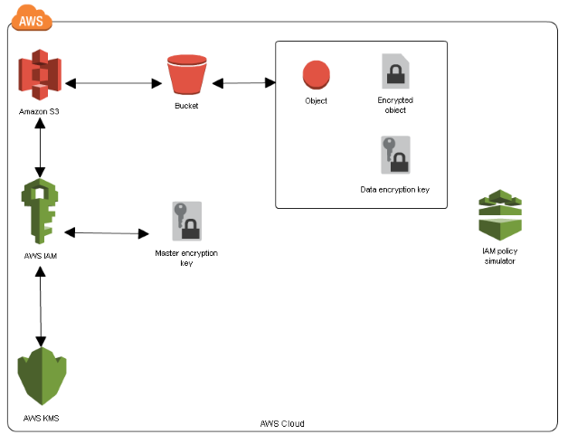

# Encryption

There are 4 methods of encrypting objects in S3

 1. **SSE-S3**: encrypts S3 objects using keys handled & managed by AWS
 2. **SSE-KMS**: uses AWS Key Management Service to manage encryption keys.
    -  Additional security (the user must have access to KMS key via IAM Policy or Role)
    -  Audit trail for KMS key usage
 3. **SSE-C**: when we want to manage our own encryption keys
 4. **Client Side Encryption**

In the **Cognitive Services AI Team,** we focus mainly on **SSE-S3** and **SSE-KMS**

All our data in S3 will  have a bucket policy to enforce encryption on upload.

# Step by Step

1. Sign in to the AWS Management Console and open the IAM console at https://console.aws.amazon.com/iam/

  - Remember to change your region to **US East (N. Virginia) us-east-1** before continuing with this README


> S3 buckets have a few conditions when naming a bucket however the console notifies you of this when setting up your bucket


2. Search for the S3 service
  - Click **"Create bucket"**
  - Remember to keep your region to **US East (N. Virginia) us-east-1** as shown below:

  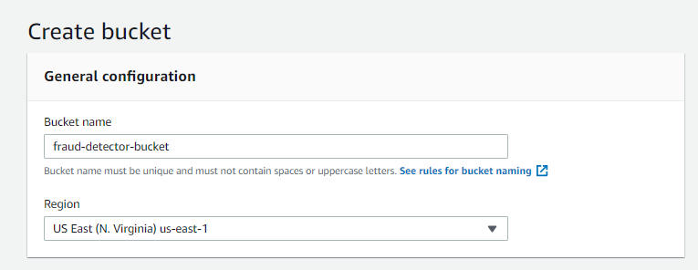

- Make sure that your permissions look like this:

  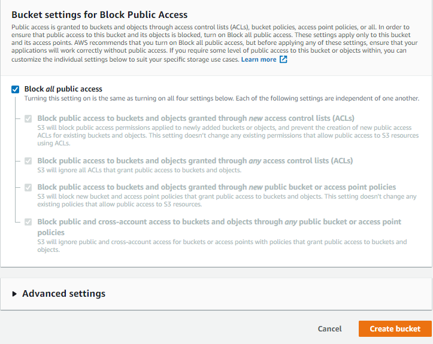

- Continue with the creation of your S3 bucket leaving the remainder of the setting as the default

3. Create an IAM Policy
  - Go to the **IAM Service**
  - Click the **"Policies"** menu item situated under the **"Access Management"** menu item
  - Click the **"Create Policy"** button
  - ** Click the "Choose a service" link **
  - Find **"Fraud Detector"** and choose the options as below:

  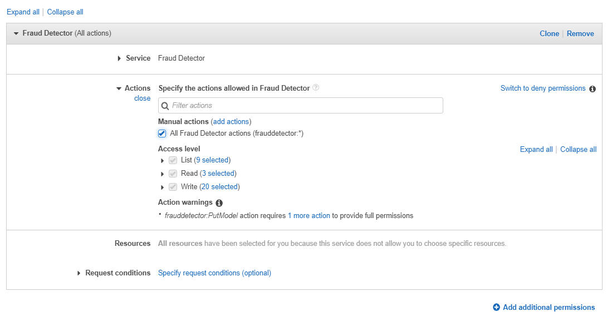

  - Click the **"+ Add additional permissions"** button
  - Repeat the **[Click the "Choose a service" link]** for **S3**

  - Your newly added S3 service should look like this:

  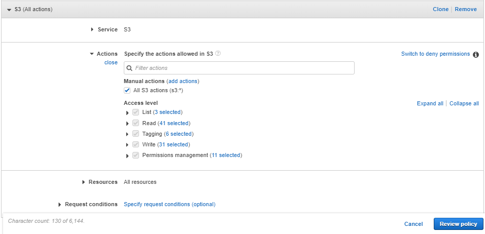

  - Click the **"Review Policy"** Button
  - Fill in the Policy details
  
  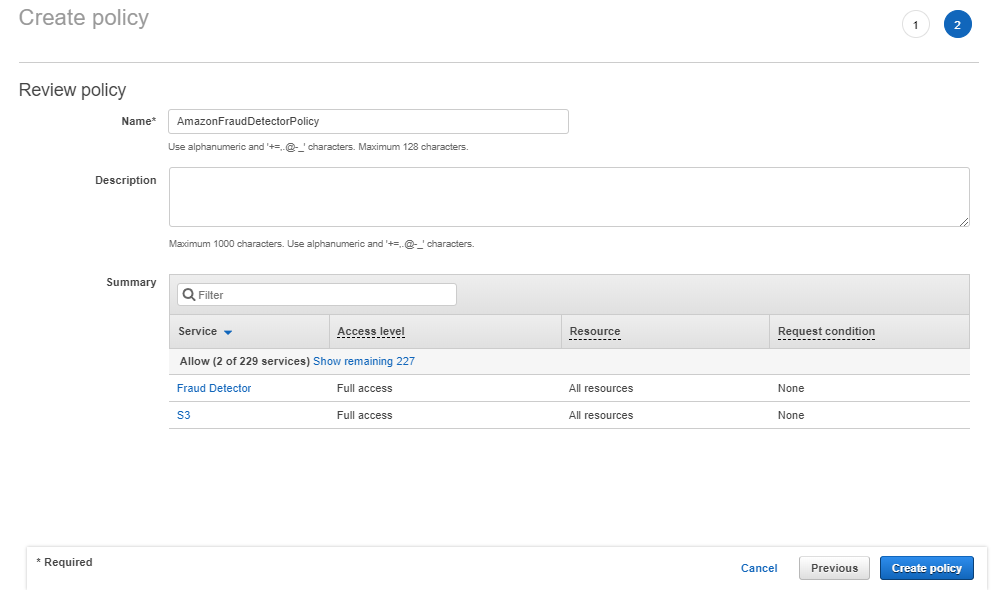

  - Click **"Create Policy"** to conclude the creation of a Policy

4. Create an IAM Role
  - Click the **"Roles"** menu item situated under the **"Access Management"** menu item
  - Click the **"Create Role"** button
  - ** Choose the options shown in the image**

 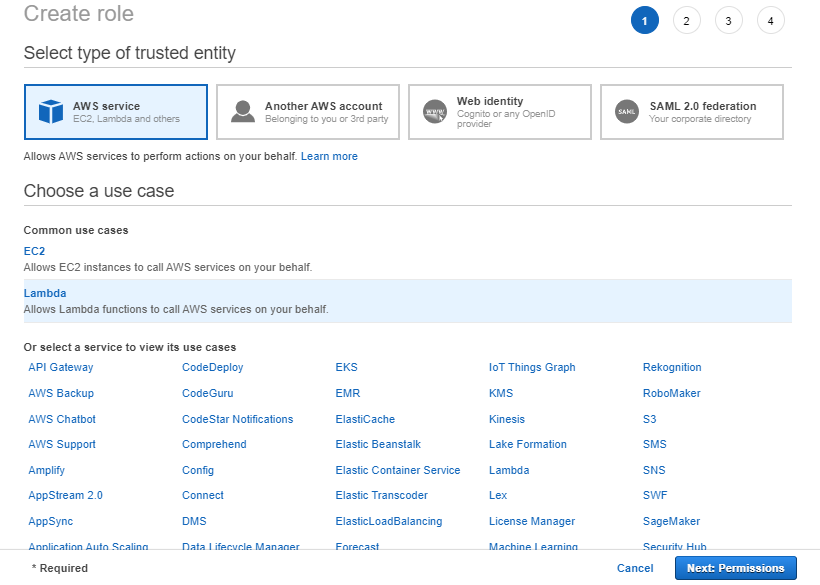

  - Click **"Next: Permissions"** button
  - Filter the policies for **AmazonFraudDetectorPolicy** and check the box
  - on the same screen, click the dropdown arrow for **Set permissions boundary**
  - Click the **"Use a permission boundary to control the maximum role permissions"** radio button
  -  Filter the policies for **BoundedPermissionPolicy** and check the box

  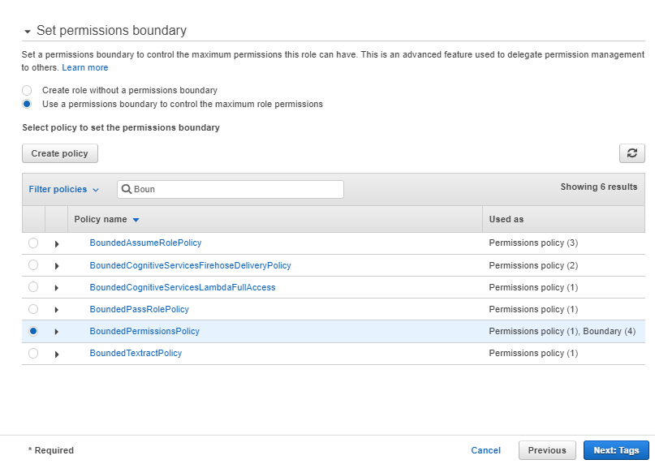

  - Click **"Next: Tags"** button
  - Click **"Next: Review"** button

  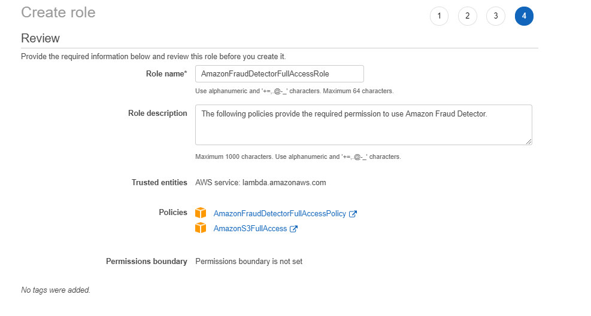

  - Click **"Create Role"** to conclude the creation of the **Role**
  - Search roles for the newly create role **(AmazonFraudDetectorFullAccessRole)** and click on it

  - Choose the **"Trust Relationships"** tab
  - Click the "Edit Trust Relationship" button
  
  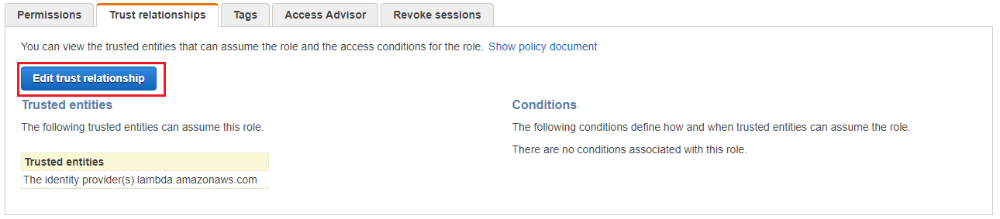

  - Edit the **"Policy Document"** to look like the image below:

  - Here is the code snippet for the Trust Relationship

  ```
    {
      "Version": "2012-10-17",
      "Statement": [
        {
          "Effect": "Allow",
          "Principal": {
            "Service": [
              "frauddetector.amazonaws.com",
              "s3.amazonaws.com"
            ]
          },
          "Action": "sts:AssumeRole"
        }
      ]
   }
  ```

  - Click the **"Update Trust Policy"** button

You are now ready to proceed into building your first Amazon Fraud Detector Model.

# 2.	Prepare your Training Dataset File

Ensure your dataset file is formatted such that:
-   Each row represents a single online event (for example, order, registration).
-	One column for the event timestamp (required for all model templates). 
-	One column for the fraud label (required for all model templates).
-	One column for each required field for the model template you intend to train. 
-	One column for each optional model input fields you want to use for training
-	Column headers are required if you are using the Amazon Fraud Detector Console to build a model. Training datasets must include column headers. Headers can only contain lowercase characters (a-z) and numeric values (0-9), without spaces. Underscores are allowed. Example: "email_address"
	Numeric data should not contain commas or currency symbols.
-	Columns with values that could contain commas (such as address or custom text) should be enclosed in double quotes. 

Save your dataset file in CSV UTF-8 (comma delimited) format (.csv).
-	The file should contain greater than 10,000 rows.
-	The file should have at least 500 examples of fraud.
-	The maximum file size is 5 gigabytes (GB).


**Event Timestamps Format**

Amazon Fraud Detector supports the following date/timestamp formats:
-	%yyyy-%mm-%ddT%hh:%mm:%ssZ (ISO 8601 standard in UTC only with no milliseconds)
Example: 2019-11-30T13:01:01Z
-	%yyyy/%mm/%dd %hh:%mm:%ss (AM/PM)
Examples: 2019/11/30 1:01:01 PM, or 2019/11/30 13:01:01
-	%mm/%dd/%yyyy %hh:%mm:%ss
Examples: 11/30/2019 1:01:01 PM, 11/30/2019 13:01:01
-	%mm/%dd/%yy %hh:%mm:%ss
Examples: 11/30/19 1:01:01 PM, 11/30/19 13:01:01

Amazon Fraud Detector makes the following assumptions when parsing date/timestamp formats for event timestamps:

-	If you are using one of the other formats, there is additional flexibility:
    -	For months and days, you can provide single or two digits. For example, 1/12/2019 is a valid date.
    -	If you provide AM/PM labels, a 12-hour clock is assumed. If there is no AM/PM information, a 24-hour clock is assumed.
    -	You can use “/” or “-” as delimiters for the date elements. “:” is assumed for the timestamp elements.


# 3. Part A: Build an Amazon Fraud Detector Model

Create a new model by associating training data with the Amazon Fraud Detector Online Fraud Insights model template. Then, you train and deploy the model.


**3.1 Define Model Details**

Fill in the required details about your model.
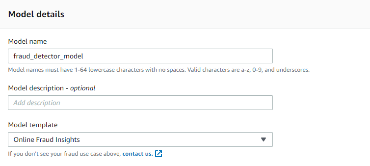


The Online Fraud Insights model template creates models designed to detect a variety of online fraud and abuse risks. This model template requires the following inputs to train a model:

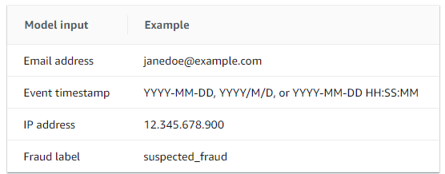

Add IAM Role ARN to grant the Fraud Detector service permission to access your historical data.

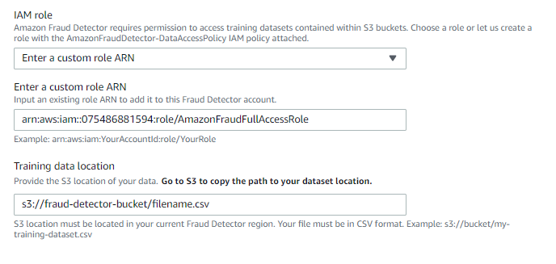


**3.2 Configure Model**

Map training dataset to model inputs. Select the rows you want to create as variables, then select a model input for each training dataset column to use them for model training. Variables will not be created for unselected rows.

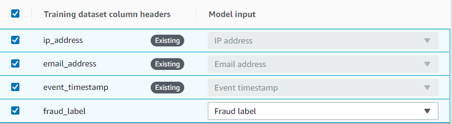


Map the values in your fraud label column into values that represent fraudulent events and values that represent legitimate events to help your model learn to distinguish between these two categories.

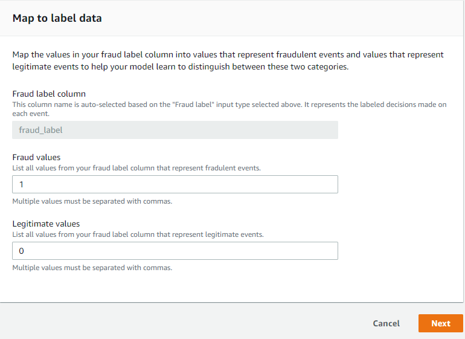

- Click **Next**


**3.3 Review and Create**

Review the model configuration to ensure your model details, training data, model inputs, and fraud labels are correct. Amazon Fraud Detector will automatically create any necessary variables as part of the model creation process.
After reviewing, click **Create and train model**. Amazon Fraud Detector will:
-	Create necessary variables
-	Create the model output variable that can be used to write rules
-	Create the model
-	Begin to train a new version of the model

**3.4 Review the Trained Model’s Performance**

After model training is complete, Amazon Fraud Detector validates model performance using **15%** of your data that was not used to train the model. You can expect your trained Amazon Fraud Detector model to have real-world fraud detection performance that is similar to the validation performance metrics.
As a business, you must balance between detecting more fraud, and adding more friction to legitimate customers. To assist in choosing the right balance, Amazon Fraud Detector provides the following tools to assess model performance:
-	**Score distribution chart** – A histogram of model score distributions for your events. The left Y axis represents the legitimate events and the right Y axis represents the fraud events. You can select a specific model threshold by choosing the chart. This will update the corresponding views in the confusion matrix and ROC chart.
-	**Confusion matrix** – Summarizes the model accuracy for a given score threshold by comparing model predictions versus actual results. Amazon Fraud Detector assumes an example population of 100,000 events. The distribution of fraud and legitimate events simulates the fraud rate in your businesses.
-	**True positives** – The model predicts fraud and the event is actually fraud.
-	**False positives** – The model predicts fraud, but the event is actually legitimate.
-	**True negatives** – The model predicts legitimate and the event is actually legitimate.
-	**False negatives** – The model predicts legitimate, but the event is actually fraud.
-	**True positive rate (TPR)** – Percentage of total fraud the model detects. Also known as capture rate.
-	**False positive rate (FPR)** – Percentage of total legitimate events that are incorrectly predicted as fraud.
-	**Receiver Operator Curve (ROC)** – Plots the true positive rate as a function of false positive rate over all possible model score thresholds. View this chart by choosing Advanced Metrics.
-	**Area under the curve (AUC)** – Summarizes TPR and FPR across all possible model score thresholds. A model with no predictive power has an AUC of 0.5, whereas a perfect model has a score of 1.0.


**To use the model performance metrics**

1.	Start with the **Score distribution** chart to review the distribution of model scores for your fraud and legitimate events. Ideally, you will have a clear separation between the fraud and legitimate events. This indicates the model can accurately identify which events are fraudulent and which are legitimate. Select a model threshold by choosing the score distribution chart. You can see how adjusting the model score threshold impacts your true positive and false positive rates.

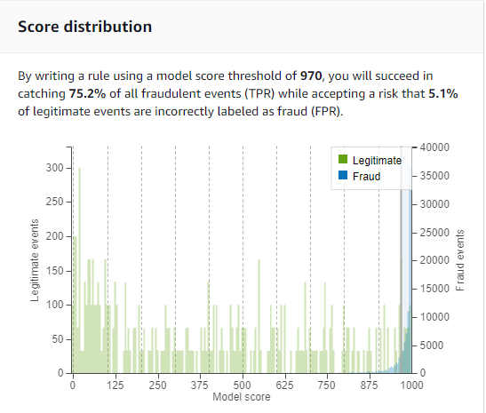 

Click anywhere on the chart above to select a model threshold score and determine the TPR and FPR. The score distribution chart plots the fraud and legitimate events on two different Y axis. The left Y axis represents the legitimate events and the right Y axis represents the fraud events.

2.	Review the **Confusion matrix**. Depending on your selected model score threshold, you can see the simulated impact based on events. The distribution of fraud and legitimate events simulates the fraud rate in your businesses. Use this information to find the right balance between true positive rate and false positive rate.

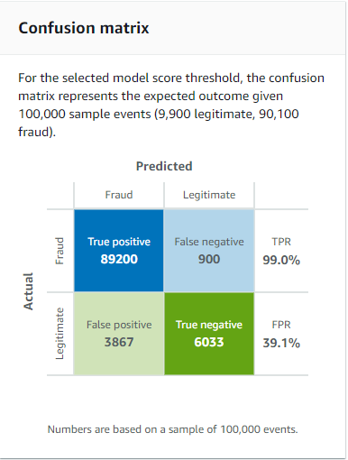 

3.	For additional details, click **Advanced Metrics**. Use the **ROC chart** to understand the relationship between true positive rate and false positive rate for any model score threshold. The **ROC curve** can help you fine-tune the trade-off between true positive rate and false positive rate.

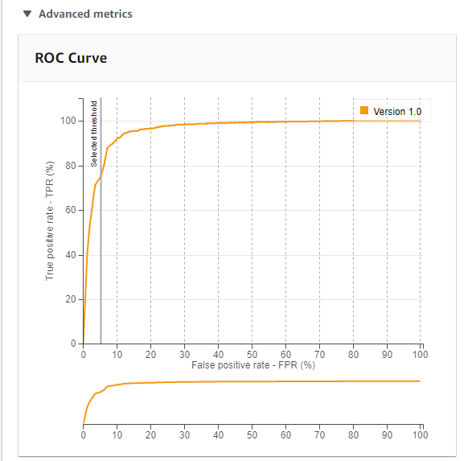 
 
You can also review metrics in table form by choosing **Table**. The table view also shows the metric **Precision**. 
**Precision** is the percentage of fraud events correctly predicted as fraudulent as compared to all events predicted as fraudulent.

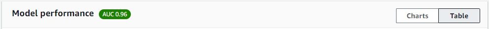  

Use the table below to determine which model threshold you should use when writing rules to evaluate events. Choose the model threshold based on the optimal true positive rate (TPR), false positive rate (FPR), and precision scores for your use case.

**How should I interpret this performance data?**

The overall performance of this model is **very high** with an AUC (area under the curve) score of 0.96. AUC summarizes the true positive rate (TPR) and false positive rate (FPR) across all possible model thresholds. A model with no predictive power will have an AUC of 0.5, whereas a perfect model will have a score of 1.0.

Based on the fifth row in the table below, by accepting a risk that **4%** of legitimate events are incorrectly labelled as fraud (FPR), you will succeed in catching **75%** of all fraudulent events (TPR) by writing a rule using a model score threshold of **970**. If you send events with model scores greater than the **970** score threshold for manual investigation, **99%** of those events would be fraudulent (Precision).

Refer to the table below to decide which model score threshold is best for your use case.

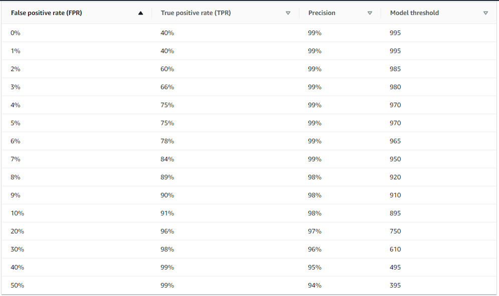  

4.	Use the performance metrics to determine the optimal model thresholds for your businesses based on your goals and fraud-detection use case. For example, if you plan to use the model to classify new account registrations as either high, medium, or low risk, you need to identify two threshold scores so you can draft three rule conditions as follows:
-	Scores > X are high risk
-	Scores < X but > Y are medium risk
-	Scores < Y are low risk


# 4.	Part B: Generate Real-Time Fraud Predictions

In Amazon Fraud Detector, you create and configure detectors to hold your deployed model and decision logic (that is, rules). In Part B, you create rules for your detector. These rules interpret the model’s score and assign outcomes (such as to flag an e-commerce transaction if the ML score is too high).

**4.1 Create a Detector**

You use a detector to house your fraud prediction configurations.
-	In the Amazon Fraud Detector console’s left navigation pane, click **Detectors**.
-	Click **Create**.
-	On **Step 1 – Define detector details**, enter **sample_fraud_detector**, and optionally enter a description for the detector, such as **my sample fraud detector**.
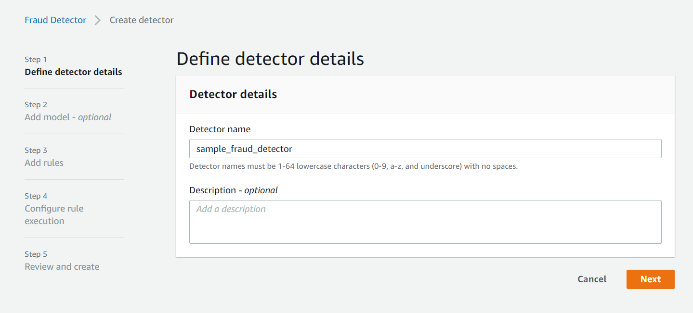  
-	Click **Next**.

**4.2 Add a Model to a Detector (Optional)**

If you completed Part A of the Get Started exercise, you should already have an Amazon Fraud Detector model available to add to your detector. If you haven't created a model yet, go to the model library, configure a new model, and then train it.

-	On **Step 2 – Add model**, click **Add Model**, choose the Amazon Fraud Detector model name and version you created and deployed in Part A: Building a Fraud Detector Model, and then click **Add model**.

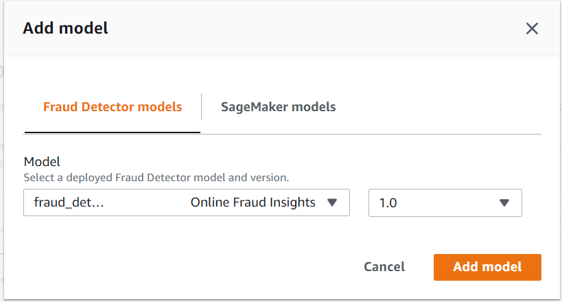
-	Click **Next**.
	

**4.3 Add Rules to a Detector**

After you have named your detector and added a model, you can create rules to interpret your Amazon Fraud Detector model’s score. For this exercise, you create three rules: **high_fraud_risk**, **medium_fraud_risk**, and **low_fraud_risk**.
-	On **Step 3 – Add rules**, enter **high_fraud_risk** for the rule name under **Define a rule**, and enter "This rule captures events with a high ML model score" as the description for the rule.

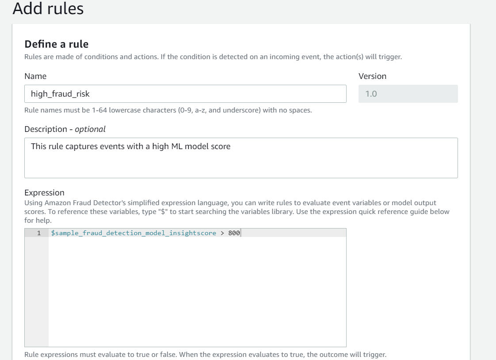 
 
-	In **Expression**, enter the following rule expression using the Amazon Fraud Detector simplified rule expression language:
**$sample_fraud_detection_model_insightscore > 800**

 

-	In **Outcomes**, click **Create a new outcome**. An outcome is the result from a fraud prediction and is returned if the rule matches during an evaluation.
-	In **Create a new outcome**, enter **verify_customer** as the outcome name. Optionally, enter a description.

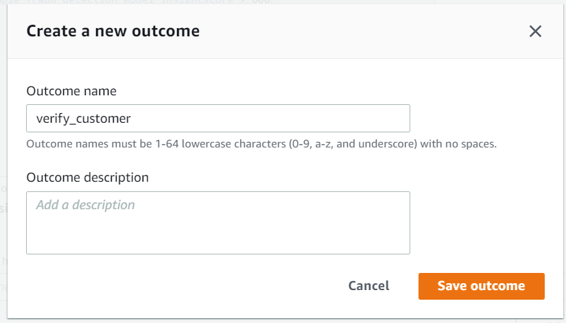 
-	Click **Save outcome**.  
-	Click **Add rule** to run the rule validation checker and save the rule. After it's created, Amazon Fraud Detector makes the rule available for use in your detector.

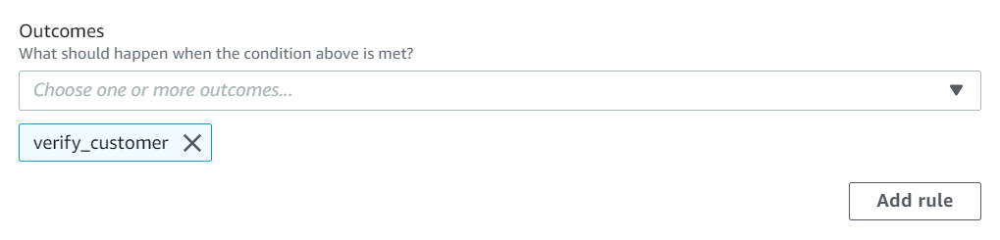 
-	Click **Add another rule**, and then click the **Create rule** tab.
-	Repeat this process twice more to create your **medium_fraud_risk** and **low_fraud_risk** rules using the following rule details:
-	**medium_fraud_risk**
- Rule name: medium_fraud_risk
- Outcome: review
- Expression: **$sample_fraud_detection_model_insightscore <= 800 and $sample_fraud_detection_model_insightscore > 200**

-	**low_fraud_risk**
- Rule name: low_fraud_risk
- Outcome: approve
- Expression: **$sample_fraud_detection_model_insightscore <= 200**

**Note**
-	These values are examples only. When creating rules for your own detector, you should use values that are appropriate based on your model, data and business.


> All added rules should resemble the image below:

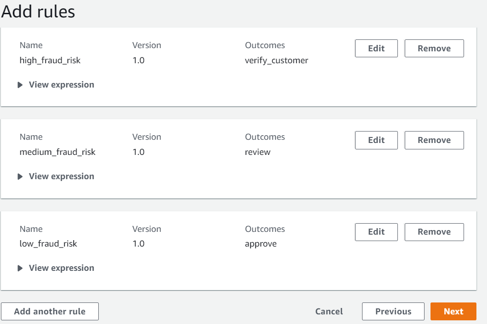 

- After you have created all three rules, click **Next**.


**4.4 Configure Rule Execution and Define Rule Order**

The rule execution mode for the rules included in the detector version determine if all the rules you define are evaluated, or if rule evaluation stops at the first matched rule. You can define and edit the rule execution mode at the detector version level, when the detector version is in draft status.
The default rule execution mode is "FIRST_MATCHED".

"First matched"
First matched rule execution mode returns the outcomes for the first matching rule based on defined rule order. If you specify "FIRST_MATCHED", Amazon Fraud Detector evaluates rules sequentially, first to last, stopping at the first matched rule. Amazon Fraud Detector then provides the outcomes for that single rule.
The order in which you execute rules can affect the resulting fraud prediction outcome. After you have created your rules, re-order the rules to execute them in the desired order by following these steps:
If your high_fraud_risk rule is not already on the top of your rule list, click Order, and then choose 1. This moves high_fraud_risk to the first position.
Repeat this process so that your medium_fraud_risk rule is in the second position and your low_fraud_risk rule is in the third position.

"All matched'
All matched rule execution mode returns outcomes for all matched rules, regardless of rule order. If you specify "ALL_MATCHED", Amazon Fraud Detector evaluates all rules and returns the outcomes for all matched rules.

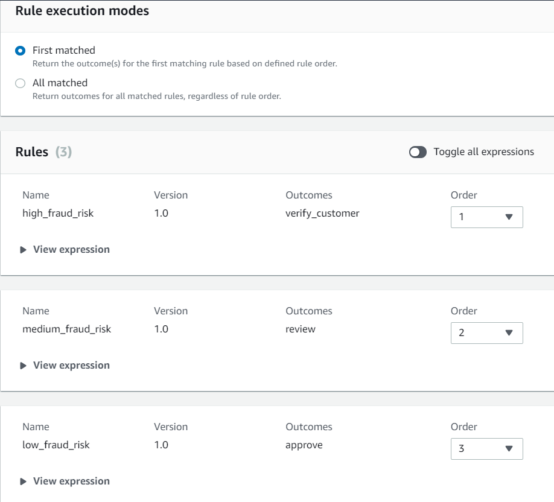 
 
-	Click **Next** to Review the model and rules you've defined for this detector
-	Click **Create Detector**.

**4.5 Test and Get Predictions**

In the Amazon Fraud Detector console, you can test your detector’s logic using mock event data with the run test feature.
-	Scroll to **Run test** at the bottom of the **Detector version details** page.
-	For **Value**, enter the variable values that you would like to test. For this exercise, you only need three input fields (that is, timestamp, email, and IP address) because these are the inputs used to train your Amazon Fraud Detector model. You can use the following example values (assuming you used the suggested variable names) in the image below: 

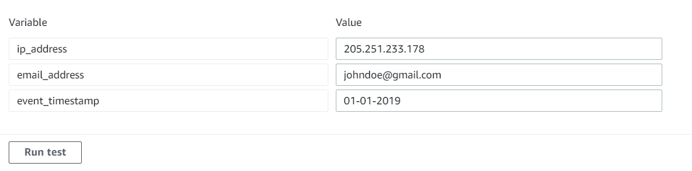  

-	Click **Run test**.
-	Amazon Fraud Detector returns the fraud prediction outcome based on the rule execution mode. If the rule execution mode is 'FIRST MATCHED", then the returned outcome corresponds to the first rule (the highest priority) that matched (evaluated to true). If the rule execution mode is "ALL MATCHED", then the returned outcome corresponds to all rules that matched (evaluated to be true). If no rules match, Amazon Fraud Detector returns "NO MATCH". Amazon Fraud Detector also returns the model score for any models added to your detector.
-	When you are satisfied that the detector is working as expected, you can promote it from **Draft** to **Active**, which makes the detector available for use in real-time fraud detection with Amazon Fraud Detector synchronous runtime API, **GetPrediction**.
On the **Detector version details** page, choose **Promote and then Save**. This changes the evaluation’s status from **Draft** to **Active**.
-	At this point, your model and associated detector logic are ready to evaluate online activities for fraud in real-time using the Amazon Fraud Detector **GetPrediction API**.


# Fraud Detection Architecture

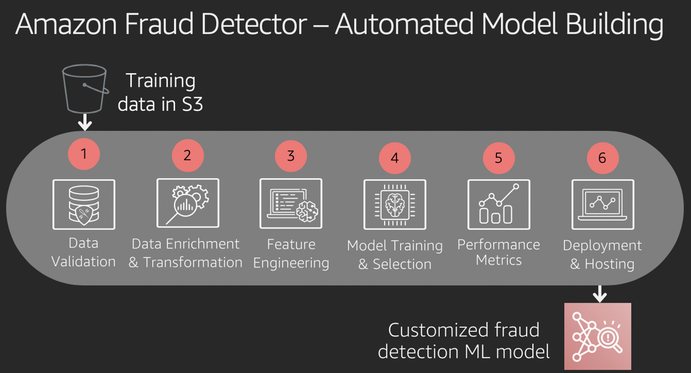


Author:
Falakhe.Mshubi@standardbank.co.za;
Developer:
Falakhe.Mshubi@standardbank.co.za
